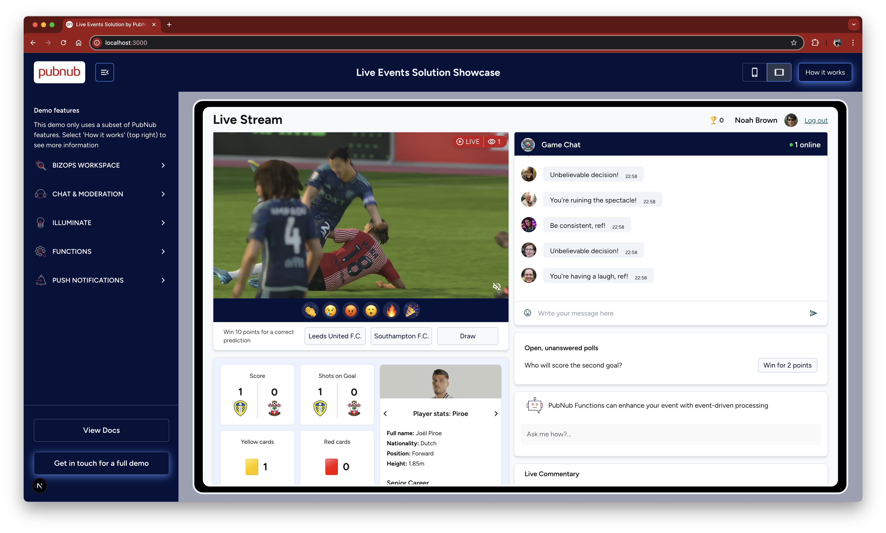

# Amazon IVS + PubNub Chat Demo

Solution showcase to demonstrate how Amazon IVS and PubNub Chat work together.  Whether you are hosting a sports event, a concert, a product launch, or any other streamed media event, Amazon IVS + PubNub Chat can deliver an interactive and engaging live stream experience for your audience.

## Demo



## What does this demo show?

- Number of people watching the live event (PubNub Presence)
- Reactions to the live event, e.g. cheering, anger, celebration (PubNub Messaging)
- Polls - Polls can be triggered through an external event, determined at runtime. (PubNub Illuminate)
- Chat - Send and receive messages (PubNub Chat SDK)
- Chat - React to messages (PubNub Chat SDK)
- Chat - Number of people participating (PubNub Presence)
- Chat - Banning or Muting users (PubNub Channel Monitor)
- Translation - PubNub Functions can translate messages as required.
- Live Commentary (PubNub Messaging)
- Adverts, triggered at runtime in response to stream activity (PubNub Illuminate)
- Gamification: user can earn points as they click ads (App Context, PubNub Illuminate)
- User and Channel Management (BizOps Workspace)
- Moderation (PubNub Channel Monitor)
- On-screen guides to show how each feature was implemented

## Installation / Getting Started

To run this project yourself you will need a PubNub account

<a href="https://admin.pubnub.com">
	
</a>

### Get Your PubNub Keys

1. You’ll first need to sign up for a [PubNub account](https://admin.pubnub.com/signup/). Once you sign up, you can get your unique PubNub keys from the [PubNub Developer Portal](https://admin.pubnub.com/).

1. Sign in to your [PubNub Dashboard](https://admin.pubnub.com/).

1. Click Apps, then **Create New App**.

1. Give your app a name, and click **Create**.

1. Click your new app to open its settings, then click its keyset.

1. Make sure your keyset has the following features enabled: Stream Controller, Presence, Persistence, App Context.  Be sure to also enable Presence for all channels in the 'Presence Management' settings (under the BizOps Workspace menu).

1. Leave Access Manager disabled for now (this is not needed for testing)

1. Copy the Publish and Subscribe keys and paste them into your app as specified in the next step.

## Building and Running

1. Clone the repository 

1. You will need to install both the front-end and back-end application to get started

### Amazon IVS Stream

Start your Amazon IVS stream, e.g. https://docs.aws.amazon.com/ivs/latest/LowLatencyUserGuide/getting-started-set-up-streaming.html.

### Front-end

Rename the `.env.example` file found under the `web` directory to `.env` and populate it with your PubNub keys, Giphy key (optional), and your Amazon IVS stream URL 

```
cd amazon-ivs-pubnub-demo
cd web
yarn install
yarn dev

Navigate to localhost:3000 in your browser
```

### Back-end (In a separate terminal)

Rename the `.env.example` file found under the `backend` directory to `.env` and populate it with your PubNub keys.  Providing the secret key is only required if you enable Access Manager on your keyset.  The backend is capable of streaming a video file through Amazon IVS on-demand, which is used in the hosted demo, but you will likely find it easier to follow the Amazon guide at https://docs.aws.amazon.com/ivs/latest/LowLatencyUserGuide/getting-started-set-up-streaming.html 

```
cd amazon-ivs-pubnub-demo
cd backend
npm install
npm run generator
```

### Translation

If you would like chat messages to be translated that are typed into the subscriber chat, create a PubNub Function of type 'After Publish or Fire' on channtl 'race.chat.*' and copy in the contents of /functions/translation.js.  You will also need to add a key to the Vault, 'AWS_access_key' which has `translate:TranslateText` permission assigned, see the comments at the top of 'translation.js' for more information.

## Questions?

Please contact [devrel@pubnub.com](devrel@pubnub.com) or raise an issue in this repository.
